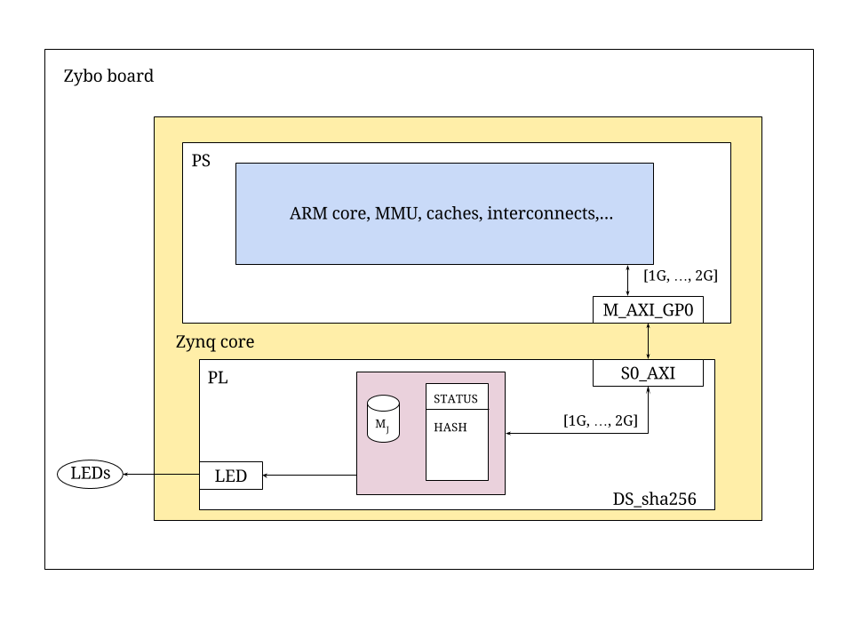

# DS_sha256
#### sha256 HW accelerator - DS project - Spring 2016

This repository and its sub-directories contain the VHDL source code, VHDL simulation environment, simulation, synthesis scripts and software for DS_sha256, a simple design example for the Xilinx Zynq core. It was specifically designed for the Zybo board by Digilent.
All provided instructions are for a host computer running a GNU/Linux operating system and have been tested on a Ubuntu 14.04.4 LTS distribution. Porting to other GNU/Linux distributions should be very easy. If you are working under Microsoft Windows or Apple Mac OS X, installing a virtualisation framework and running an Ubuntu OS on a virtual machine is probably the easiest path.
To run the project on a Zybo board, *you don't need to clone this repository*, just follow the [instructions](#setup).

This work is based on the very interesting [SAB4Z project](https://gitlab.eurecom.fr/renaud.pacalet/sab4z) by Renaud Pacalet, who kindly helped us to successfully complete this design.
If you have any problem when running this project, first check on the [SAB4Z project page](https://gitlab.eurecom.fr/renaud.pacalet/sab4z) for a solution: it is likely that you will find useful information there. In addition, in this repository there are all the files you need to build your own copy of DS_sha256. To do so, follow the instructions on the [SAB4Z project page](https://gitlab.eurecom.fr/renaud.pacalet/sab4z).

Please signal errors and send suggestions for improvements to federico.madotto (at) gmail.com.


## Table of content
* [License](#License)
* [Content](#Content)
* [Description](#Description)
* [Quick setup: how to run the project](#setup)
    * [Notation](#notation)
    * [Copy the files to the MicroSD card](#copyfilesd)
    * [Interact with the Zybo](#interactwithzybo)
    * [Run DS_sha256 on the Zybo](#runonzybo)
    * [Halt the system](#RunHalt)

## <a name="License"></a>License
Copyright (c) 2016 Federico Madotto and Coline Doebelin
Based on the [SAB4Z project](https://gitlab.eurecom.fr/renaud.pacalet/sab4z) by Renaud Pacalet at Telecom ParisTech.

DS_sha256 is free software: you can redistribute it and/or modify it under the terms of the GNU General Public License as published by the Free Software Foundation, either version 3 of the License, or (at your option) any later version.

DS_sha256 is distributed in the hope that it will be useful, but WITHOUT ANY WARRANTY; without even the implied warranty of MERCHANTABILITY or FITNESS FOR A PARTICULAR PURPOSE.  See the GNU General Public License for more details.

You should have received a copy of the GNU General Public License along with this program. If not, see <http://www.gnu.org/licenses/>.

## <a name="Content"></a>Content
```
 .
 ├── LICENSE                                    License (English version)
 ├── sd_files                
 │   ├── boot.bif         
 │   ├── boot.bin
 |   ├── devicetree.dtb
 |   ├── fsbl.elf
 |   ├── put_these_files_on_the_sd.tar.gz       Archive to extract on the SD card
 |   ├── top_wrapper.bit
 |   ├── u-boot.elf
 |   ├── ulmage
 │   └── uramdisk.image.gz
 ├── src                     
 │   ├── hdl                                    VHDL source code
 │   │   ├── axi_pkg.vhd                        Package of AXI definitions
 │   │   ├── M_j_memory.vhd                     Memory to store the values of the 512-bit message to hash
 │   │   ├── sha256.vhd                         Implementation of the sha256 hash function
 │   │   ├── sha256_pl.vhd                      Top-level entity
 │   │   ├── sha256_tb.vhd                      Test bench for testing sha256.vhd
 │   │   ├── start_FF.vhd                       Auto-resetting flip flop for the start signal
 │   │   └── old_design                         VHDL sources of the old design. Use freely!
 │   │       └── ...
 │   ├── scripts                                Scripts
 │   │   ├── boot.bif                           Zynq Boot Image description File
 │   │   ├── dts.tcl                            TCL script for device tree generation
 │   │   ├── fsbl.tcl                           TCL script for FSBL generation
 │   │   ├── ila.tcl                            TCL script for ILA debug cores
 │   │   ├── uEnv.txt                           Definitions of U-Boot environment variables
 │   │   └── vvsyn.tcl                          Vivado TCL synthesis script
 │   └── sh                 
 │       └── sha256.sh
 ├── Makefile                                   Main makefile
 ├── README.md                                  This file
 ├── images                                     Figures
 |   └── sha256_diagram.png                         Zybo board
 └── utils                   
     ├── extract_warnings.sh                    Extracts the warnings found in ./build/vv/vivado.log
     └── sha_test.py                            Python implementation of the sha256 function. For debugging.
```

## <a name="Description"></a>Description
**DS_sha256** is an implementation of a hardware accelerator for performing the [sha256 hash function](http://csrc.nist.gov/publications/fips/fips180-2/fips180-2.pdf).
It is based on the [SAB4Z project](https://gitlab.eurecom.fr/renaud.pacalet/sab4z) by Renaud Pacalet at Telecom ParisTech.
It uses a lite AXI slave port (`S0_AXI`), a master AXI port (`M_AXI_GP0`), several internal, 32-bit registers (`status`, `start` and the registers for storing the computed hash value) and a led to signal that the operation is finished. Its VHDL synthesizable model is available in the `src/hdl` sub-directory.
The figure below represents DS_sha256 mapped in the Programmable Logic (PL) of the Zynq core of a Zybo board. DS_sha256 is connected to the Processing System (PS) of the Zynq core by above-mentioned AXI port. When the ARM processor of the PS reads or writes at addresses in the `[1G..2G[` it accesses DS_sha256, through its `S0_AXI` port.



---

**Note**: The current design for the PL of DS_sha256 is written at a very high level. This is due to the fact that the previous design, based on [this IEEE paper](http://ieeexplore.ieee.org/xpl/articleDetails.jsp?arnumber=1269207) and implemented in the `src/hdl/old_design` sub-directory was too cumbersome to debug and the time for doing it was too little. This is because of the choice of implementing such a design at a *very* low level.
If you want to correct any bugs or propose solutions regarding the "old_design" you are free and welcome to contact us.
The consequences of this high-level implementation, it is that it is not really efficient.

---

The AXI slave port `S0_AXI` is used to access the registers and memory implemented in the PL. The mapping of the `S0_AXI` address space is the following:

| Address       | Mapping         | Description                                 | 
| :------------ | :---------------| :------------------------------------------ | 
| `0x4000_0000` | Status register | 32 bits read-only status register           | 
| `0x4000_0004` | M<sub>0</sub>              | 32 bits write-only register                 | 
| `0x4000_0008` | M<sub>1</sub>              | 32 bits write-only register                 | 
| ...           | ...             | ...                                         | 
| `0x4000_0040` | M<sub>15</sub>             | 32 bits write-only register                 | 
| `0x4000_0044` | start           | 32 bits write-only register                 | 
| `0x4000_0048` | H<sub>A</sub><sup>(i-1)</sup>       | 32 bits read-only register                  | 
| `0x4000_004c` | H<sub>B</sub><sup>(i-1)</sup>       | 32 bits read-only register                  | 
| ...           | ...             | ...                                         | 
| `0x4000_0064` | H<sub>H</sub><sup>(i-1)</sup>        | 32 bits read-only register                  | 


The least significant bit of the status register is assigned to the "done" signal so it can be used to detect when a computation is terminated.

Addresses from `0x4000_0004` to `0x4000_0040` are used to store the value of the 512-bit already padded message to be hashed.

By writing any 32-bit value at the `0x4000_0044` address, the PL will start the computation.

The resulting hash will be the concatenation of the hexadecimal values found in the registers from `0x4000_0048` (most significant value) to `0x4000_0064` (least significant value).

Accesses to the unmapped region of the `S0_AXI` address space will raise DECERR AXI errors. Write accesses to the read-only registers will raise SLVERR AXI errors.

---

The actual computation is now carried out by launching a bash script ran on a Linux system loaded by the board. It is far from perfection and it was quickly made in order to give a proof of functioning of the logic.
To know how to use it, read [Quick setup: how to run the project](#setup).

---

A Python implementation (`utils/sha_test.py`), equivalent to the implemented hardware implementation, has been written to manually check the correctness of the programmable logic while in execution.


## <a name="setup"></a>Quick setup: how to run the project

#### <a name="notation"></a>Notation

Since different prompts for different contexts are used, this will be the notation used in this README:

* `$ ` is the shell prompt of a regular user on the host PC.
* `Sab4z> ` is the shell prompt of the root user on the Zybo board.

#### <a name="copyfilesd"></a>Copy the files to the MicroSD card

Download the archive, insert a MicroSD card in your card reader and unpack the archive to it:

      $ cd /tmp
      $ wget https://github.com/fmadotto/DS_sha256/blob/master/sd_files/put_these_files_on_the_sd.tar.gz?raw=true -O put_these_files_on_the_sd.tar.gz
      $ tar -C <path-to-mounted-sd-card> -xf put_these_files_on_the_sd.tar.gz
      $ sync
      $ umount <path-to-mounted-sd-card>

Eject the MicroSD card.

#### <a name="interactwithzybo"></a>Interact with the Zybo

* Plug the MicroSD card in the Zybo and connect the USB cable.
* Check the position of the jumper that selects the power source (USB or power adapter).
* Check the position of the jumper that selects the boot medium (MicroSD card).
* Power on. Two new character devices should show up (`/dev/ttyUSB0` and `/dev/ttyUSB1` by default) on the host PC. `/dev/ttyUSB1` is the one corresponding to the serial link with the Zybo.
* Launch a terminal emulator (picocom, minicom...) and attach it to the new character device, with a 115200 baudrate, no flow control, no parity, 8 bits characters, no port reset and no port locking (`picocom -b115200 -fn -pn -d8 -r -l /dev/ttyUSB1`). If you don't have a terminal emulator installed, install it with:
```
$ sudo apt-get intall picocom
```


* Wait until Linux boots, log in as root (no password needed) and start interacting with DS_sha256.
```
$ picocom -b115200 -fn -pn -d8 -r -l /dev/ttyUSB1
...
Welcome to SAB4Z (c) Telecom ParisTech
sab4z login: root
Sab4z>
```
    
---

**Note**: If when you try to connect to the Zybo board with picocom you get the `FATAL: cannot open /dev/ttyUSB1: Permission denied` error, follow these instructions.
You have to add a udev rule to create the character device with read/write permissions for all users when a FT2232H chip is discovered. In the same udev rule you will also create a symbolic link with meaningful name on the newly created character device:
```
$ cd /tmp
$ sub='SUBSYSTEMS=="usb"'
$ itf='ATTRS{interface}=="Digilent Adept USB Device"'
$ ifn='ATTRS{bInterfaceNumber}=="01"'
$ mod='MODE="0666"'
$ sym='SYMLINK+="zybo%n"'
$ echo "$sub, $itf, $ifn, $mod, $sym" > 99-ft2232h.rules
$ sudo mv 99-ft2232h.rules /etc/udev/rules.d/
$ sudo udevadm control --reload-rules
```

#### <a name="runonzybo"></a>Run DS_sha256 on the Zybo

Mount the MicroSD card at `/mnt` on the Zybo:
```
Sab4z> mount /dev/mmcblk0p1 /mnt
```

You will probably get some errors at this point. Check that you see the files that you put at [this point](#copyfilesd) of the procedure:
```
Sab4z> ls -al /mnt
```
Launch the core program for performing the hash with your string as a parameter:
```
Sab4z> /mnt/sha256.sh foobaraaaaaaaaaaaaaaaaaaaaaaaaaaaaaaaaa
```
Wait for the result to be printed on screen.

#### <a name="RunHalt"></a>Unmounting the MicroSD card and halting the system

When you have finished to play with DS_sha256, always unmount the MicroSD card and halt properly before switching the power off:
```
Sab4z> umount /mnt
Sab4z> poweroff
Sab4z> Stopping network...Saving random seed... done.
Stopping logging: OK
umount: devtmpfs busy - remounted read-only
umount: can't unmount /: Invalid argument
The system is going down NOW!
Sent SIGTERM to all processes
Sent SIGKILL to all processes
Requesting system poweroff
reboot: System halted
```
At this point you can switch the power off.
